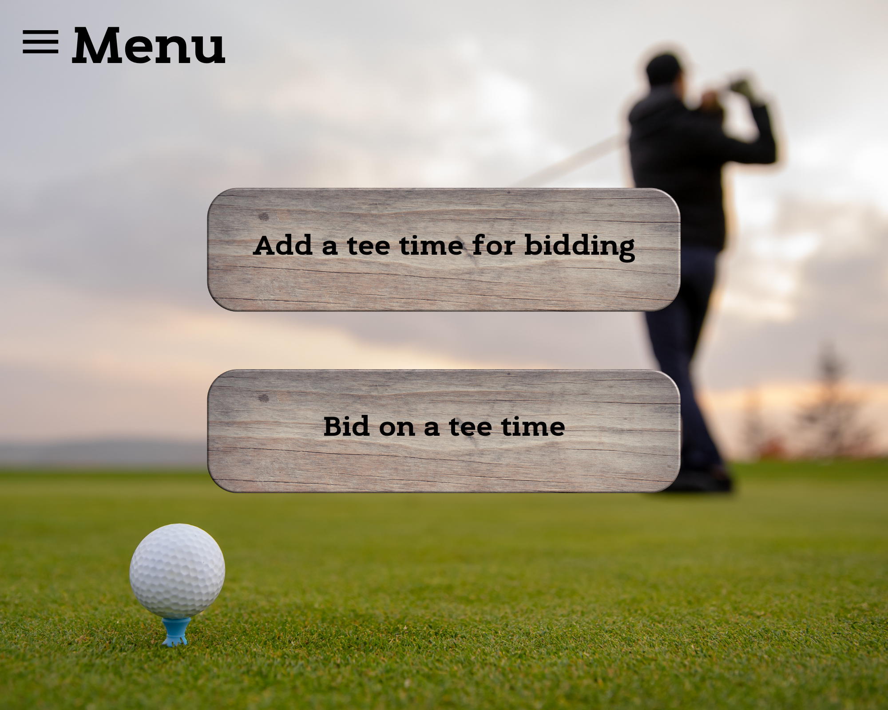
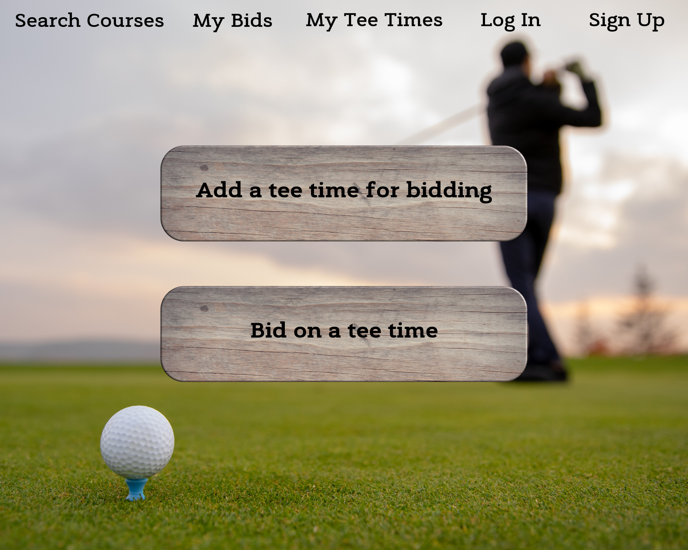
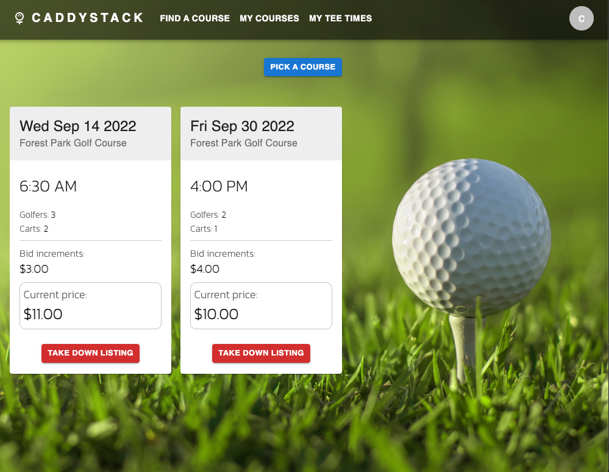
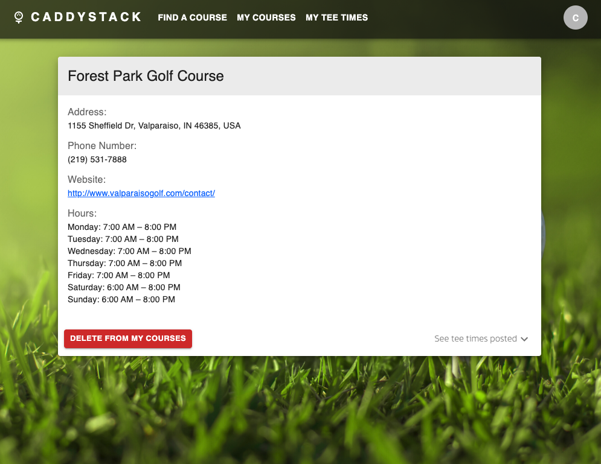
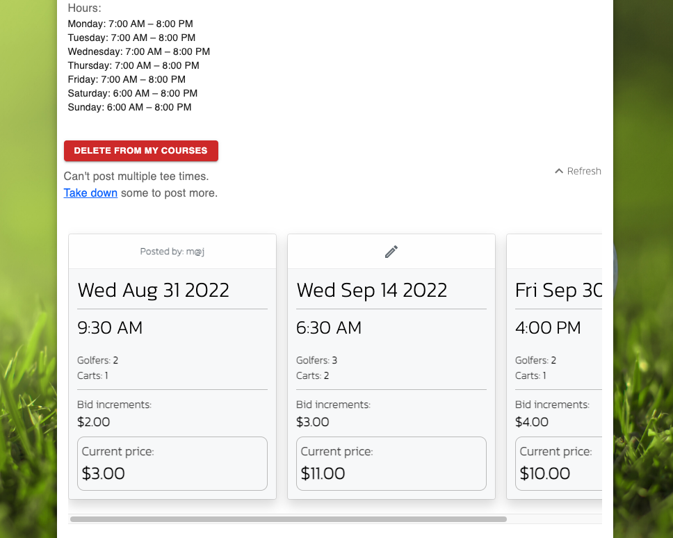
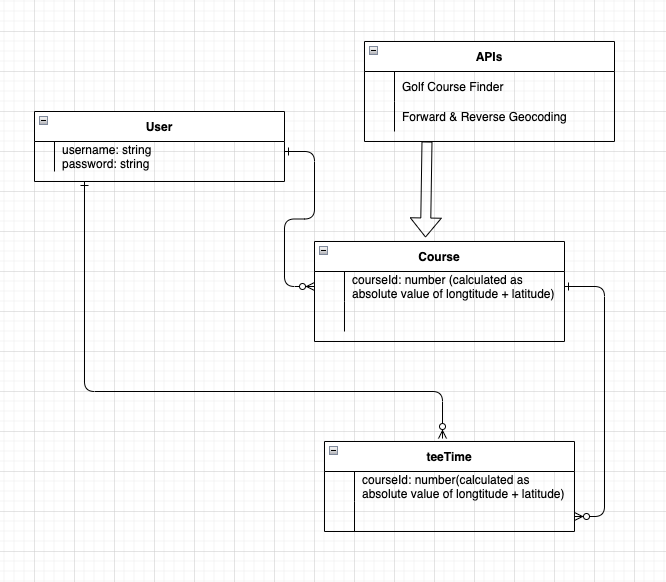

# [Title]

***

### PROJECT CONCEPT
Have you ever had a tee time at this spectacular, popular golf course that you couldn't make? Wouldn't it be nice to be able to sell it(especially if the course was going to charge you for not showing)?

[Title] has your back. Utilizing React(front-end) and Express(back-end), [Title] creates a marketplace for any golf course that lets golfers post their tee times for sale and also bid on other golfers' tee times. The golfer who originally posted the tee time for sale can close bidding by accepting another golfer's bid at any time, at which point the accepting golfer will email reservation information to the golfer who's bid was accepted. The golfer who originally posted the tee time can also just close bidding without accepting a bid, at which point all golfers that bid on the tee time will be notified that bidding has been cancelled. Bidding automatically closes 2 hours before the tee time's start regardless. If no bid is accepted 2 hours before the tee time's start, then the tee time is deleted from the course's marketplace automatically and every golfer that placed a bid on that tee time is notified that bidding has been cancelled.

***

### USER STORY
1. Unregistered user will be able to navigate to index of all courses with open bids
2. Unregistered user will be able to sign up(register) using a username of their choosing
3. Unregistered user will be able to click on any course on index page and view a show page of that course; which will consist of the course's name, address, phone number, photos, and a link to the course's own website
4. Unregistered user will be able to click on any course on index page and view a show page of all bids posted to that course.
5. Unregistered user will be able to search for any course by zip code
6. Unregistered user will get feedback saying their search is invalid if they type in a non-existent zip code to the search box
7. Unregistered user will get feedback saying their search is invalid if they type in a zip code that has no golf courses within a 50-mile radius
8. Registered user will be able to sign in
9. Credentialed user will be able to sign out
10. Credentialed user will be able to update password
11. Credentialed user will be able to navigate to index of all courses with open bids
12. Credentialed user will be able to click on any course on index page and view a show page of that course; which will consist of the course's name, address, phone number, photos, and a link to the course's own website
13. Credentialed user will be able to click on any course on index page and view a show page of all bids posted to that course.
14. Credentialed user will be able to search for any course by zip code
15. Credentialed user will get feedback saying their search is invalid if they type in a non-existent zip code to the search box
16. Credentialed user will get feedback saying their search is invalid if they type in a zip code that has no golf courses within a 50-mile radius
17. Credentialed user can post a new tee time to a course's show page for bidding
18. Credentialed user can bid on any tee time on any course's show page
19. Credentialed user can accept a bid for a tee time they posted
20. Credentialed user can cancel bidding for a tee time they posted at any time by deleting the tee time

***

### WIREFRAMES

***

### APIs
##### Golf Course Finder
##### https://rapidapi.com/golfambit-golfambit-default/api/golf-course-finder/details

##### Forward & Reverse Geocoding
##### https://rapidapi.com/GeocodeSupport/api/forward-reverse-geocoding/details

***

### ERD (Entity Relationship Diagram)

***

##### STRETCH GOALS
- Map embedded in search page to show heat map of golf courses per region