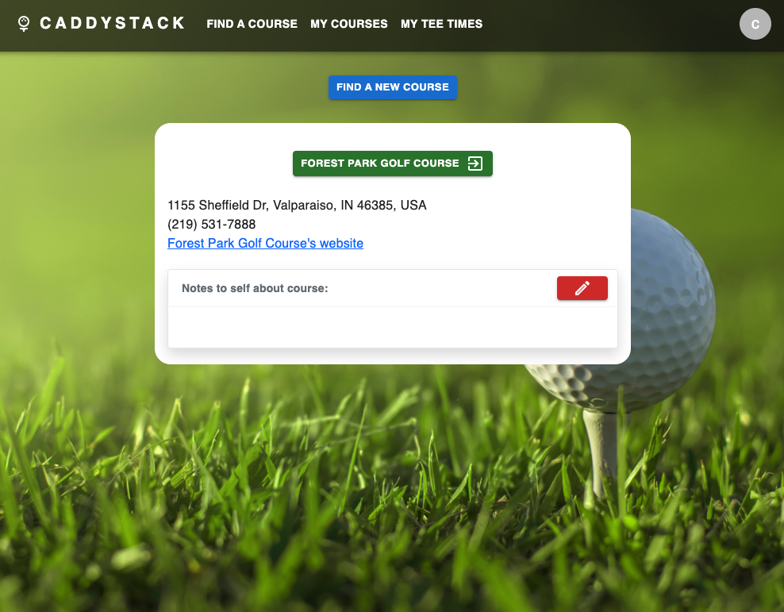

# Caddystack

***

### PROJECT CONCEPT
Have you ever had a tee time at this spectacular, popular golf course that you couldn't make? Wouldn't it be nice to be able to sell it(especially if the course was going to charge you for not showing)?

Caddystack has your back. Utilizing React(front-end) and Express(back-end), Caddystack creates a marketplace for any golf course that lets golfers post their tee times for sale and also bid on other golfers' tee times. The golfer who owns the teetime can close bidding by accepting another golfer's bid at any time, at which point the accepting golfer will email reservation information to the golfer who's bid was accepted. The golfer who own the tee time can also just close bidding without accepting a bid, at which point all golfers that bid on the tee time will no longer see the tee time listed.

Golfers can also just save courses to a list called 'My Courses' which they can then refer to back to at any time. 'My Courses' page also allows you to take notes on any course for your own personal reference. This is useful to not just golfers but anyone looking to host an event at a number of nice courses, which tend to be able to accomodate large groups in their banquet areas

There is also a 'My Tee Times' page that displays all tee times that you own that are currently posted. This is perfect for referring back to all tee times you won OR posted that are still listed, and taking their listings down from the same place.

***

### USER STORY
1. Unregistered user will be able to navigate to index of all courses with open bids
2. Unregistered user will be able to sign up(register) using a username of their choosing
3. Unregistered user will be able to click on any course on index page and view a show page of that course; which will consist of the course's name, address, phone number, photos, and a link to the course's own website
4. Unregistered user will be able to click on any course on index page and view a show page of all bids posted to that course.
5. Unregistered user will be able to search for any course by zip code
6. Unregistered user will get feedback saying their search is invalid if they type in a non-existent zip code to the search box
7. Unregistered user will get feedback saying their search is invalid if they type in a zip code that has no golf courses within a 50-mile radius
8. Registered user will be able to sign in
9. Credentialed user will be able to sign out
10. Credentialed user will be able to update password
11. Credentialed user will be able to navigate to index of all courses with open bids
12. Credentialed user will be able to click on any course on index page and view a show page of that course; which will consist of the course's name, address, phone number, and a link to the course's own website
13. Credentialed user will be able to click on any course on index page and view a show page of all bids posted to that course.
14. Credentialed user will be able to search for any course by zip code
15. Credentialed user will get feedback saying their search is invalid if they type in a non-existent zip code to the search box
16. Credentialed user can post a new tee time to a course's show page for bidding
17. Credentialed user can bid on any tee time on any course's show page
18. Credentialed user can accept a bid for a tee time they posted
19. Credentialed user can cancel bidding for a tee time they have posted at any time by deleting the tee time
20. Credentialed user can view all their tee times that they own from the 'My Tee Times' page
21. Credentialed user can view a list of all their added courses on the 'My Courses' page
22. Credentialed user can take notes on any golf course that they added to 'My Courses'

***

### WIREFRAMES

***

### APIs
##### Golf Course Finder
##### https://rapidapi.com/golfambit-golfambit-default/api/golf-course-finder/details

##### Forward & Reverse Geocoding
##### https://rapidapi.com/GeocodeSupport/api/forward-reverse-geocoding/details

***

### ERD (Entity Relationship Diagram)

***

##### STRETCH GOALS
- Map embedded in search page to show heat map of golf courses per region